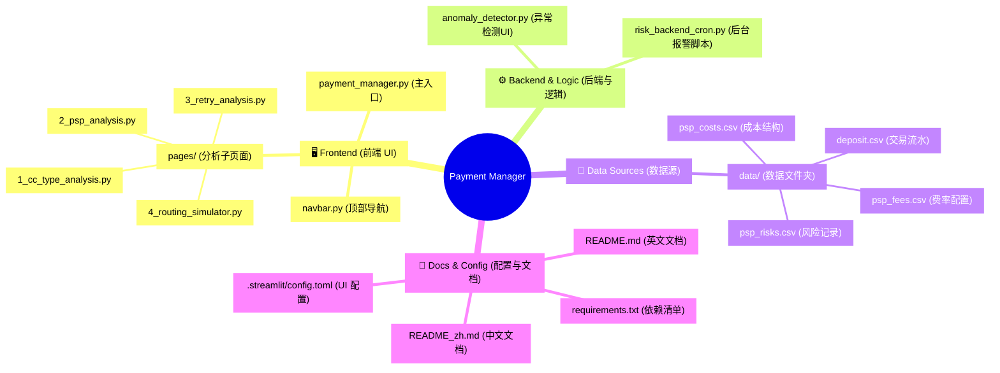

[🇨🇳 简体中文](README_zh.md) | [🇬🇧 English](README.md)

# 💼 Payment Manager: Cost & Risk Control Dashboard

<details>
<summary><b>🗺️ Click to view Project Architecture Mindmap (点击展开查看项目架构)</b></summary>

<br>


</details>    

## 📖 Overview
The **Payment Manager Dashboard** is a comprehensive, Streamlit-based web application designed as a centralized control tower for the payment management team. 

Initially prototyped as a standard analytics tool (`app_1.py`), the project has evolved into a fully-fledged, Payment Manager-centric platform. The primary entry point (`payment_manager.py`) now integrates real-time risk monitoring, PSP cost management, and strategic pipeline tracking, while the underlying analytical tabs provide deep insights into routing efficiency and salvage performance.

---

## ✨ Key Features & Modules

### 1. 🛡️ Payment Manager (Main Page: `payment_manager.py`)
This is the command center for the Payment Manager.
* **Real-time Anomaly Monitor:** Automatically refreshes every 10 minutes to detect sudden drops in approval rates. Anomalies are displayed via immediate UI Toasts and persistent critical banners at the top of the dashboard.
* **Admin Authentication:** Secure access control for editing sensitive cost and risk data.
* **Planned Payment Gateways Pipeline:** A visual Gantt chart tracking the integration phases of future PSPs (Contracting, Tech Integration, UAT & Live).
* **Active Risk & Incident Management:** A dynamic, color-coded Kanban-style alert system tracking ongoing operational issues, frozen funds, or reserve increases.
* **PSP Cost & Risk Structure Table:** An interactive database interface allowing admins to update settlement fees, reserve rates, and release terms.

### 2. 💳 CC Type Analysis (`pages/1_cc_type_analysis.py`)
* Displays overall Merchant Insights and Approval Time-trends.
* Features intuitive Gauge Charts breaking down real-time approval rates by specific credit card brands (VISA, Mastercard, JCB, AMEX) across different merchants.

### 3. 📊 PSP Analysis (`pages/2_psp_analysis.py`)
* **Smart Routing & Cost Analysis:** Explores approval rate differences across various PSPs for the same merchant and card type.
* Includes dense Heatmaps for PSP vs. Card Type performance and Bar/Line combo charts to evaluate processing volume versus approval success.

### 4. 🔄 Retry Analysis (`pages/3_retry_analysis.py`)
* **Salvage Value Analytics:** Quantifies the exact dollar amount of revenue salvaged through the smart retry strategy.
* Visualized using Waterfall charts for net revenue impact and comprehensive Sankey/Funnel diagrams showing retry conversion rates per PSP.

### 5. 🔀 Routing Simulator (`pages/4_routing_simulator.py`)
* **"What-If" Scenario Modeling:** An interactive sandbox for the Payment Manager.
* Users can adjust sliders to allocate expected monthly traffic volume across different PSPs to instantly project the **Blended Approval Rate**, **Estimated Total Cost**, and potential **Net Savings** compared to historical baselines.

---

## 🏗️ Architecture & Scripts Setup

To support real-time alerting and maintain a clean UI, the application logic is decoupled into frontend rendering and backend background jobs.

### Frontend Components
* **`navbar.py`**: A custom horizontal navigation bar that replaces Streamlit's default left sidebar (hidden via `.streamlit/config.toml`), offering a modern Web App UX.
* **`anomaly_detector.py`**: A UI component script imported into the main page. **Note:** Currently uses mock data for demonstration purposes, fully prepared to integrate with real-time SQL database queries in the next phase.

### Backend Monitoring (Cron Job)
* **`risk_backend_cron.py`**: A standalone Python daemon script running on a 10-minute schedule (`schedule` library).
* **Current Status:** Ready for SQL integration. It currently simulates database checks.
* **Action:** Upon detecting a critical anomaly, it uses Webhooks (`requests` library) to push an automated **🚨 URGENT PAYMENT ALERT** directly to the team's Slack Payment Channel.

---

## 📂 Project Structure

```text
Merchant_Deposit/
│
├── .streamlit/
│   └── config.toml                  # Hides default sidebar navigation
│
├── pages/
│   ├── 1_cc_type_analysis.py        # Card performance analytics
│   ├── 2_psp_analysis.py            # Routing & Cost analytics
│   ├── 3_retry_analysis.py          # Salvage value tracking
│   └── 4_routing_simulator.py       # What-if allocation sandbox
│
├── payment_manager.py               # 🌟 MAIN ENTRY POINT (Dashboard Home)
├── app_1.py                         # Legacy prototype (Deprecated)
├── navbar.py                        # Custom top navigation component
├── anomaly_detector.py              # Anomaly UI rendering logic (Mocked for SQL)
├── risk_backend_cron.py             # Background task for Slack alerts (Mocked for SQL)
│
├── data/                            # Data storage folder
│   ├── deposit.csv                  # Transaction data source
│   ├── psp_costs.csv                # PSP fee structures
│   ├── psp_fees.csv                 # Fee mapping
│   └── psp_risks.csv                # Dynamic risk records


🚀 Installation & Usage

1. Install Dependencies:

Ensure you have Python installed, then run:
pip install streamlit pandas plotly streamlit-autorefresh schedule requests

2. Start the Frontend Dashboard:
Run the Streamlit app from the root directory:
streamlit run payment_manager.py

3. Start the Backend Alerting Daemon (Open a separate terminal):
To enable Slack notifications and background monitoring:
python risk_backend_cron.py

🗺️ Future Roadmap
SQL Database Integration: Refactor anomaly_detector.py and risk_backend_cron.py to replace mock data with active SQLAlchemy or psycopg2 queries polling the live production database.

Automated Muting/Resolution: Allow Payment Managers to click "Acknowledge" on an active anomaly on the dashboard, which will temporarily pause Slack alerts for that specific issue.